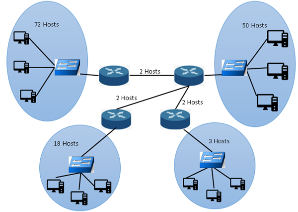

# VLSM Subnetting Task Documentation

## Task Description

The Variable Length Subnet Masking (VLSM) task involves dividing a single Class C IP address space into multiple subnets based on the number of hosts required for each subnet. This is a common practice in IP networking to efficiently utilize the available IP address space.

### Requirements

- **Base Network**: 116.11.9.0/24
- **Subnets**:
  - Red 1: 72 Hosts
  - Red 2: 50 Hosts
  - Red 3: 18 Hosts
  - Red 4: 3 Hosts
  - Red 5: 2 Hosts
  - Red 6: 2 Hosts
  - Red 7: 2 Hosts

### Output for each subnet:

- Network Name
- Requested Hosts
- Network Address
- Prefix
- Subnet Mask (in decimal)
- Available Hosts
- Initial and Final Host
- Broadcast Address

## Code Documentation

The provided Python script uses the `ipaddress` module from the Python Standard Library to calculate and print the subnetting scheme for a given IP address space.

### Functions

#### `needed_host_bits(number_of_hosts)`

Calculates the minimum number of host bits required to support the specified number of hosts in a subnet.

- **Parameters**:
  - `number_of_hosts`: The number of hosts the subnet needs to support.

- **Returns**:
  - The number of bits needed for the hosts.

#### `calculate_subnets_corrected(base_network, subnets)`

Calculates the subnets based on the base network and the requirements of each subnet.

- **Parameters**:
  - `base_network`: The base network in CIDR notation.
  - `subnets`: A list of dictionaries, each containing the name and the number of hosts required for the subnet.

- **Returns**:
  - A list of dictionaries, each containing the subnetting information.

### Main Process

1. **Sort the subnets** by the number of required hosts in descending order.
2. **Calculate the subnetting** for each subnet based on its position and requirements.
3. **Output the subnetting information** for each subnet including network address, prefix, subnet mask, available hosts, initial and final host, and broadcast address.

### Usage

- Update the `subnets_info` list with the subnet names and the number of required hosts.
- Run the script to get the calculated VLSM scheme.

### Example Output

The script outputs a list of dictionaries, each representing a subnet with the following keys:
- `subnet_name`
- `requested_hosts`
- `network_address`
- `prefix`
- `subnet_mask`
- `available_hosts`
- `first_host`
- `last_host`
- `broadcast_address`

Each key corresponds to the subnet's properties as per the given task's requirements.
